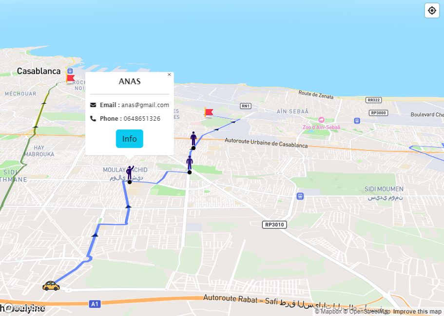
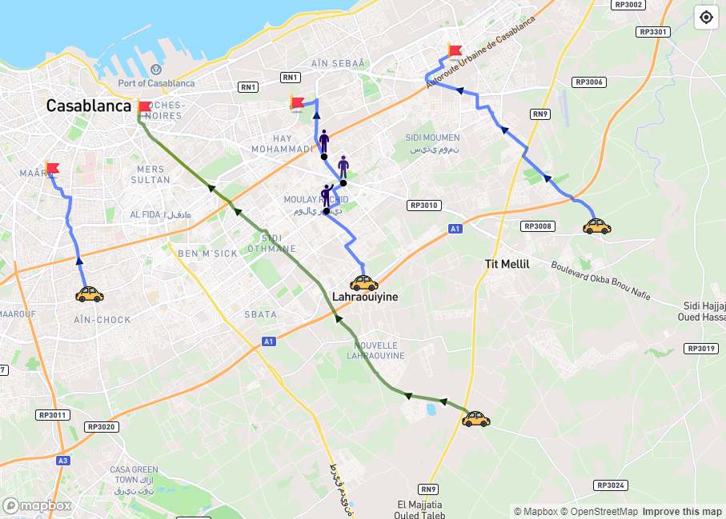

# Carpooling v1

this project is a carpooling solution designed to connect like-minded travelers, allowing them to share rides and minimize travel costs. the project seamlessly integrates Spring Boot, Angular, MongoDB, and the MapBox API to enhance the carpooling experience.

## Key Features

1. **Cost-Effective Travel:** Enable users to find and connect with fellow travelers to share rides, significantly reducing individual travel expenses.

2. **Spring Boot Backend:** Utilize the robust Spring Boot framework to build a scalable and efficient backend system that manages user profiles, ride requests, and trip optimization.

3. **Angular Frontend:** Create a modern and intuitive user interface using Angular, providing a seamless experience for users to search, join, or create carpooling trips.

4. **MongoDB Database:** Employ MongoDB as the database of choice for its flexibility and scalability, ensuring efficient storage and retrieval of user data, trip details, and preferences.

5. **MapBox Integration:** Utilize the MapBox API to optimize trip paths, minimize travel time, and calculate fair cost distribution among participants. Additionally, provide an interactive map view for users to visualize their journey.

6. **Real-time Communication:** Implement web sockets for real-time communication, enabling users to coordinate and communicate with their travel companions instantly.

## Demo

*Passengers*

*Passengers*

